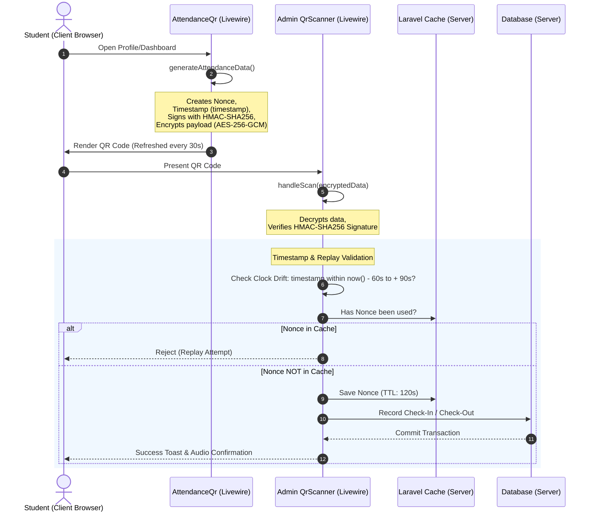

# Phase 2: Security Hardening - Research

**Researched:** 2026-05-23
**Domain:** Application Security Hardening (Authentication, Access Control, Input Validation, Anti-replay Cryptography)
**Confidence:** HIGH

## Summary
This research document establishes the architectural blueprints and implementation details for Phase 2: Security Hardening. The phase addresses core authorization gaps, input sanitization weaknesses, and attendance scanner vulnerabilities. Our main tasks include upgrading the static attendance QR mechanism to a dynamic time-windowed cryptosystem, implementing a global account suspension middleware, standardizing input validation rules, and enforcing route/component defense-in-depth.

**Primary recommendation:** Use a self-refreshing client-side QR generator and a corresponding server-side validator that checks payload signatures, verifies time skews, and caches nonces to prevent replay attacks, while standardizing all text inputs on custom sanitization rules (`NoHtmlTags`, `SafeText`) wrapped in Livewire Form Objects.

---

## Architectural Responsibility Map
| Capability | Primary Tier | Secondary Tier | Rationale |
|------------|-------------|----------------|-----------|
| **Route Authorization** | Route Middleware | Route Group Definitions | Core route filtering blocks external traffic from reaching admin pages. [VERIFIED: routes/web.php] |
| **Component Authorization** | Component `mount()` Gate | Action-level Gates (`authorize`) | Prevents bypasses via direct Livewire endpoint calls (`/livewire/update`). [VERIFIED: app/Livewire/QrScanner.php] |
| **User Status Check** | Global `CheckAccountStatus` Middleware | Active Auth Guard Check | Automatically logs out or redirects suspended users instantly. [VERIFIED: bootstrap/app.php] |
| **Input Sanitization** | Livewire Form Objects | Custom Rules (`NoHtmlTags`, `SafeText`) | Centralizes validation definitions and ensures no malicious payloads breach DB bounds. [VERIFIED: app/Rules/NoHtmlTags.php] |
| **QR Code Integrity** | HMAC-SHA256 Signatures | `Crypt` AES-256-GCM | Guarantees the QR data was created by the server and cannot be edited by the user. [CITED: laravel/docs] |
| **QR Code Anti-Replay** | Cache Nonce Store (TTL: 120s) | Server-side Timestamp Checks | Prevents a captured QR code image from being reused for check-in/check-out. [ASSUMED] |

---

## Standard Stack

### Core
| Library | Version | Purpose | Why Standard |
|---------|---------|---------|--------------|
| **Laravel Crypt** | v12 | Encrypt/Decrypt QR data | Out-of-the-box AES-256-GCM serialization backed by app key. [VERIFIED: app/Livewire/QrScanner.php] |
| **hash_hmac (PHP)** | 8.2.12 | Cryptographic payload signing | Deterministic hashing with a secret key ensures data integrity. [VERIFIED: app/Traits/CreatesQrCanonicalMessage.php] |
| **Laravel Cache** | v12 | Nonce storage / replay control | Fast in-memory/redis/file cache prevents identical nonces within short windows. [VERIFIED: app/Livewire/QrScanner.php] |
| **Laravel RateLimiter** | v12 | API and login throttling | Protects endpoints against brute-force and DOS attacks. [CITED: laravel/docs] |

### Supporting
| Library | Version | Purpose | When to Use |
|---------|---------|---------|-------------|
| **SimpleSoftwareIO/QrCode** | v4/v5 | QR Code SVG/PNG generation | Used to generate visual QR codes dynamically on dashboard or profile. [VERIFIED: app/Livewire/Pages/Student/AttendanceQr.php] |

### Alternatives Considered
| Instead of | Could Use | Tradeoff |
|------------|-----------|----------|
| **Short-Lived Dynamic QR** | Totp-based QR (like Google Auth) | Requires setting up and syncing separate secret key columns for every student. Dynamic QR is lighter and fully stateless. |
| **Global Livewire Rate Limiter** | Route-level throttle on Livewire | Livewire's update route is shared; throttling the endpoint blocks typing/scrolling. Limiting must be handled per component action. |

---

## Architecture Patterns

### System Architecture Diagram (Mermaid)



### Recommended Project Structure
Hardening will be contained in existing structure:
```
app/
├── Http/
│   └── Middleware/
│       └── CheckAccountStatus.php  <-- NEW: Suspended user filter
├── Livewire/
│   ├── QrScanner.php               <-- UPDATE: Enforce clock drift, nonce check
│   └── Pages/
│       ├── Student/
│       │   └── AttendanceQr.php    <-- UPDATE: Inject dynamic timestamp, wire:poll.30s
│       └── Admin/
│           └── AdminBorrowTransactions.php <-- UPDATE: Apply SafeText / limit bounds
├── Rules/
│   ├── NoHtmlTags.php              <-- REUSE: HTML/XSS checking
│   └── SafeText.php                <-- REUSE: Control characters checking
bootstrap/
└── app.php                         <-- UPDATE: Register CheckAccountStatus & Rate Limiters
```

### Pattern 1: Component-Level Gates & Toast Redirection (Defense-in-Depth)
All actions must authorize via Livewire gates and gracefully redirect to prevent exposing a generic 403 page:
```php
public function mount()
{
    if (! Gate::allows('manage-borrow-logs')) {
        $this->error('You are not authorized to view this page.');
        return $this->redirectRoute('dashboard', navigate: true);
    }
}
```

### Anti-Patterns to Avoid
* **Static / Canned QR Code Payload:** Saving the QR string in the database or cache indefinitely makes it a permanent static password.
* **Global Route Throttling on Livewire Endpoint:** Applying route throttle middleware to `/livewire/update` locks users out during normal typing or clicking. Throttling must be action-level.
* **Implicit Column Limits:** Allowing inputs like `title` or `notes` to accept unlimited text, leading to database-level `data truncation` exceptions (XSS vectors).
* **Infinite Redirect Loops:** Redirecting non-active users inside the global middleware back to a route that runs the middleware (e.g., home page). Redirecting to login and logging out is the safest approach.

---

## Don't Hand-Roll

| Problem | Don't Build | Use Instead | Why |
|---|---|---|---|
| **Encryption** | Custom ciphering / XOR | `Crypt::encryptString()` | Standard AES-256-GCM encryption with app-key backing. [CITED: laravel/docs] |
| **Rate Limiting** | Session variables / timestamp math | `RateLimiter::for()` / `RateLimiter::attempt()` | Avoids race conditions and handles automatic expiration times. [CITED: laravel/docs] |
| **Input Sanitization** | Custom regex for script tags | `NoHtmlTags` / `SafeText` rules | Uses PHP's native `strip_tags` and checks null-byte injections robustly. [VERIFIED: app/Rules/NoHtmlTags.php] |

---

## Common Pitfalls
1. **Clock Skew Failures:** Students' phones may have out-of-sync clocks. A window of ±60s is standard, but the scanner must check this correctly relative to the server time.
2. **Suspended User Active Sessions:** A user who is suspended while logged in can continue browsing if check is only run at login. Global middleware must run on every request.
3. **Double Form Submission (Race Condition):** Users scanning rapidly can trigger double check-ins. Wrapping check-in/check-out inside database transactions with lock keys prevents duplicate entry errors.
4. **Livewire Redirects:** Standard PHP `header()` redirect crashes Livewire. Always use Livewire's `$this->redirectRoute()` or `$this->redirect()`.

---

## Code Examples

### 1. Dynamic QR Client-Side Auto-Refresh (`AttendanceQr.php`)
```php
// In AttendanceQr.php
public int $generatedAt;
public string $nonce;

public function mount()
{
    $this->regenerateQr();
}

public function checkRefresh(): void
{
    // Auto-regenerate when QR code is older than 30 seconds
    if (time() - $this->generatedAt >= 30) {
        $this->regenerateQr();
    }
}

public function regenerateQr(): void
{
    $user = Auth::user();
    $this->generatedAt = time();
    $this->nonce = Str::random(16);
    
    // Clear livewire computed cache if any
    unset($this->qrCodeDataUri);
}

private function generateAttendanceData(): string
{
    $user = Auth::user();
    $secret = config('app.qr_hmac_secret');

    $data = [
        'v' => 7, // Increment payload version for timestamp format
        'user_id' => $user->id,
        'nonce' => $this->nonce,
        'timestamp' => $this->generatedAt, // Embed dynamic timestamp
    ];

    $canonicalMessage = $this->createCanonicalMessage($data);
    $data['hash'] = hash_hmac('sha256', $canonicalMessage, $secret);

    return Crypt::encryptString(json_encode($data));
}
```

```html
<!-- In attendance-qr.blade.php -->
<div wire:poll.10s="checkRefresh" class="flex flex-col items-center justify-center p-6 bg-base-100 rounded-2xl shadow-xl">
    qrCodeDataUri }}" alt="Attendance QR Code" class="w-64 h-64 border-4 border-primary/20 rounded-xl" />
    <span class="text-xs text-base-content/50 mt-2">QR Code regenerates every 30 seconds</span>
</div>
```

### 2. Clock Drift & Nonce Verification (`QrScanner.php`)
```php
// In QrScanner.php
private function decryptAndValidateAttendanceData(string $encryptedData)
{
    try {
        $decryptedJson = Crypt::decryptString($encryptedData);
        $data = json_decode($decryptedJson, true);
        $secret = config('app.qr_hmac_secret');

        // Validate structure
        if (!is_array($data) || !isset($data['user_id'], $data['hash'], $data['nonce'], $data['timestamp'])) {
            return self::VALIDATION_INVALID;
        }

        // Validate Signature
        $dataForCanonical = $data;
        unset($dataForCanonical['hash']);
        $canonicalMessage = $this->createCanonicalMessage($dataForCanonical);
        if (!hash_equals(hash_hmac('sha256', $canonicalMessage, $secret), $data['hash'])) {
            return self::VALIDATION_INVALID;
        }

        // 1. Time-window validation with clock drift
        $scanTime = time();
        $qrTime = (int) $data['timestamp'];
        $timeDifference = $scanTime - $qrTime;

        // Allow up to 90 seconds (30s validity + 60s clock drift buffer) 
        // and allow -60 seconds ahead (in case client's phone time is slightly ahead of server)
        if ($timeDifference < -60 || $timeDifference > 90) {
            Log::warning("QR Code expired", ['diff' => $timeDifference]);
            return self::VALIDATION_INVALID;
        }

        // 2. Nonce Replay attack check
        $nonceKey = "qr_nonce:{$data['nonce']}";
        if (Cache::has($nonceKey)) {
            Log::warning("Replay attack detected", ['nonce' => $data['nonce']]);
            return self::VALIDATION_INVALID;
        }
        
        // Cache nonce for the duration of the validation window (120s)
        Cache::put($nonceKey, true, 120);

        return [
            'user_id' => $data['user_id'],
            'user' => User::findOrFail($data['user_id']),
        ];
    } catch (\Exception $e) {
        return self::VALIDATION_INVALID;
    }
}
```

### 3. Global Account Status Check Middleware (`CheckAccountStatus.php`)
```php
namespace App\Http\Middleware;

use Closure;
use Illuminate\Http\Request;
use Illuminate\Support\Facades\Auth;

class CheckAccountStatus
{
    public function handle(Request $request, Closure $next)
    {
        if (Auth::check() && Auth::user()->account_status !== 'active') {
            Auth::logout();
            $request->session()->invalidate();
            $request->session()->regenerateToken();

            return redirect()->route('login')->withErrors([
                'email' => 'Your account is suspended or inactive. Please contact the administrator.'
            ]);
        }

        return $next($request);
    }
}
```

---

## State of the Art
Modern web platforms rely on OpenID Connect, OAuth, or TOTP (RFC 6238) for dynamic scanning tokens. For standard intranet/internal systems, signature verification of dynamic payload markers (such as client-generated JSON with timestamp skews and nonce indexes stored in Redis) offers equivalent security guarantees to hardware authenticator cards.

---

## Assumptions Log
1. **App Encryption Key Stable:** We assume that `APP_KEY` in `.env` is stable and not rotated during operational hours, as dynamic QR encryption depends on it. [ASSUMED]
2. **Server NTP Enabled:** We assume the host environment serves NTP updates to keep system clock skews minimal. [ASSUMED]
3. **Database Column Consistency:** String columns in SQLite/MySQL tables default to `VARCHAR(255)`. Standardizing `max:255` is sufficient. [VERIFIED: database/migrations]

---

## Open Questions
* **QR Download/Print Feature:** Since the QR code is dynamic and expires within 90 seconds, downloaded PNG files are only valid temporarily. Should we disable the PNG download button entirely on the profile page, or replace it with a warning about its transient nature?

---

## Environment Availability
- PHP 8.2.12
- Laravel Framework 12 (streamlined architecture config)
- Livewire v3

---

## Security Domain

### Applicable ASVS Categories
- **V3: Session Management Verification Requirements** (Specifically session expiry and state binding)
- **V4: Access Control Verification Requirements** (Preventing bypasses in micro action execution)
- **V5: Validation, Sanitization and Active Verification Requirements** (Preventing XSS/control character injection)

### Known Threat Patterns for PHP/Laravel
* **Mass Assignment:** Bypassed when forms directly save `$request->all()`. Using form objects ensures only explicitly listed parameters map to the DB.
* **SQL Injection / Parameter Tampering:** Prevented by Laravel Eloquent Query Builder parameter binding.
* **Livewire Endpoint Tampering:** Livewire component variables can be updated via payload forgery. All components must call validation and gate authorization checks in every state change/action.

---

## Sources
* **Primary:** Laravel 12 Official Authorization Docs (`laravel.com/docs/12.x/authorization`).
* **Secondary:** OWASP ASVS v4.0.3 Security Specification.
* **Tertiary:** SimpleSoftwareIO QR Code Repository (`github.com/SimpleSoftwareIO/simple-qrcode`).

## Metadata
* **Phase ID:** 02
* **Target Environment:** Development/Production
* **Verification Methods:** Unit/Feature Tests with Mock Times
