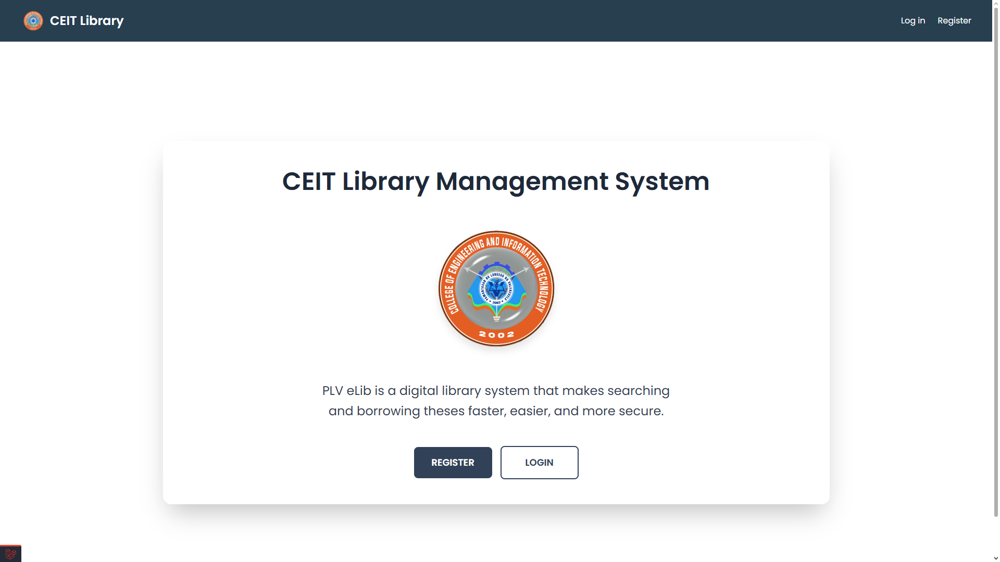
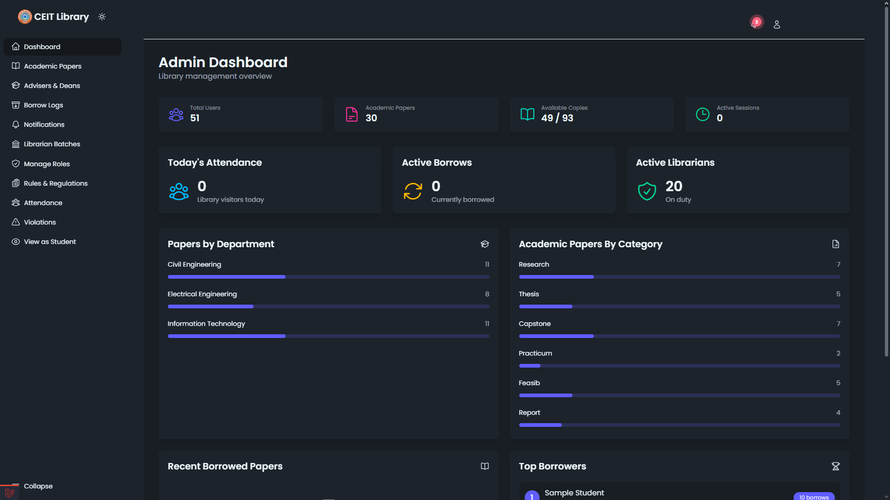
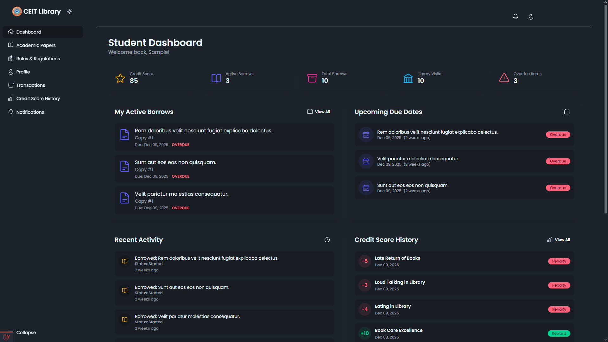
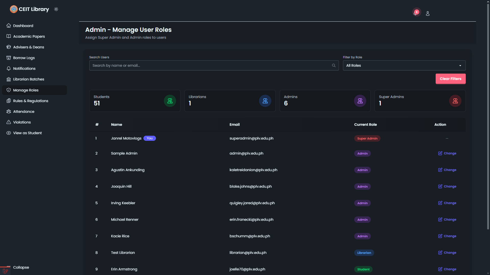
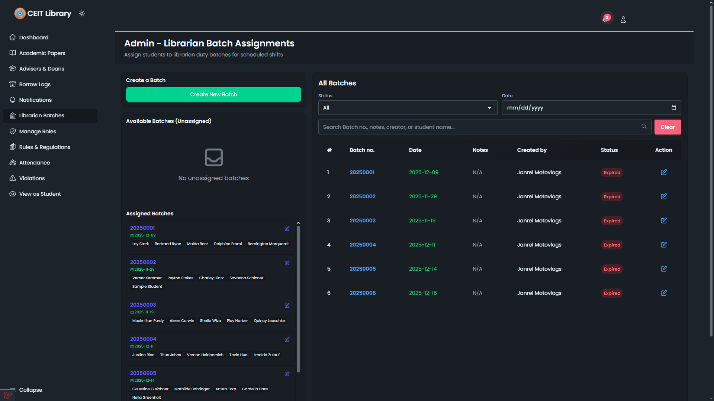
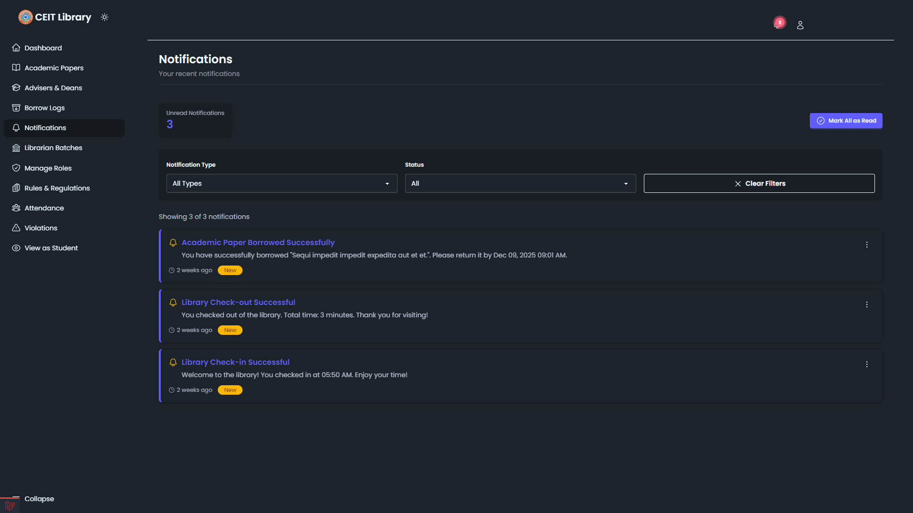
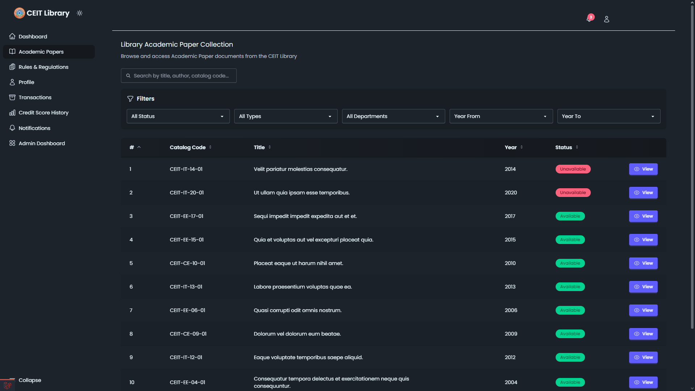
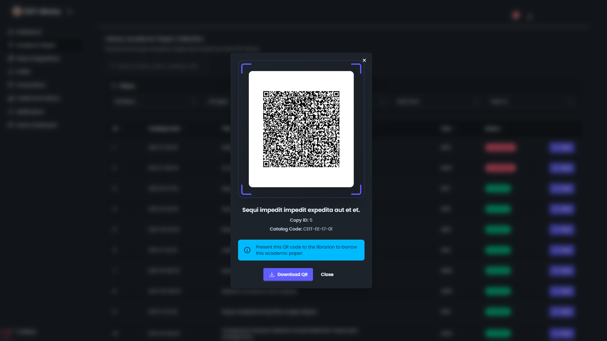
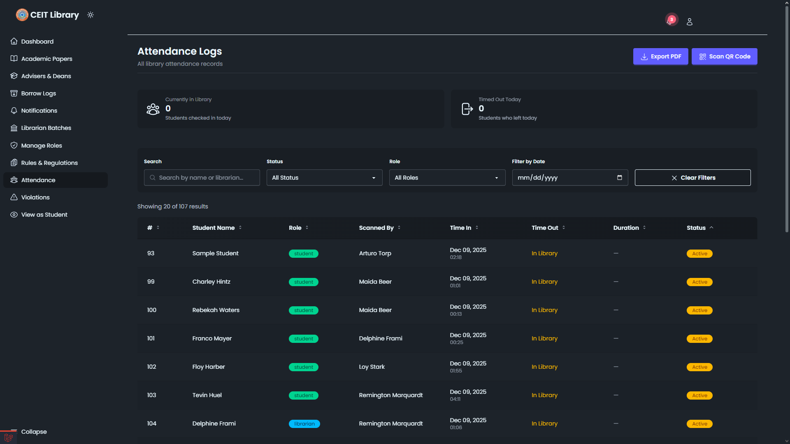
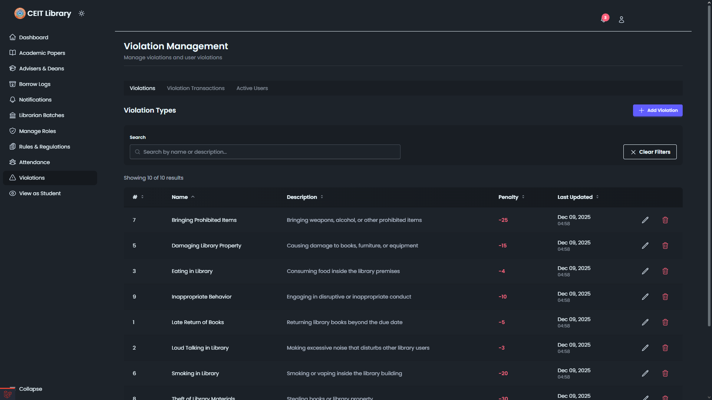

# CEIT-Library

CEIT-Library is a modern, role-based library management system for academic institutions, built with Laravel 12, Livewire 3, and DaisyUI. It supports advanced user roles, batch librarian assignments, real-time notifications, and robust test coverage.

---

## 🚀 Features

- **Role-Based Access Control**: Super Admin, Admin, Librarian, and Student roles with granular permissions
- **Librarian Batch System**: Assign students to librarian duty in fixed-size batches with automatic role management
- **Real-Time Notifications**: Alerts for assignments, activations, borrow events, and system updates
- **Academic Paper Borrowing**: Track, manage, and log paper borrowing with status updates
- **Attendance & Violation Tracking**: Monitor attendance and log rule violations
- **Modern UI**: DaisyUI + Alpine.js for fast, responsive, and accessible interfaces
- **Comprehensive Testing**: 200+ automated tests and detailed test case documentation

---

## 📸 Screenshots

<!--
    Place all screenshots in the `public/screenshots/` folder for organization.
    Example: public/screenshots/login.png
-->












---

## 🛠️ Requirements

- PHP >= 8.2
- Laravel 12.x
- MySQL (or compatible database)
- Node.js & npm (for frontend assets)

---

## ⚡ Installation

1. **Clone the repository:**

    ```sh
    git clone https://github.com/RPVisuals/CEIT-Library.git
    cd CEIT-Library
    ```

2. **Install PHP dependencies:**

    ```sh
    composer install
    ```

3. **Install Node dependencies:**

    ```sh
    npm install
    ```

4. **Copy and configure environment:**

    ```sh
    cp .env.example .env
    # Edit .env with your database and mail settings
    ```

5. **Generate application key:**

    ```sh
    php artisan key:generate
    ```

6. **Run migrations and seeders:**

    ```sh
    php artisan migrate --seed
    ```

7. **Build frontend assets:**

    ```sh
    npm run build
    # Or for development:
    npm run dev
    ```

8. **Start the development server:**
    ```sh
    php artisan serve
    ```

---

## 🧑‍💻 Usage

- **Login** with provided test credentials (see [TEST_CASES.md](TEST_CASES.md))
- **Manage Roles**: `/admin/manage-roles` (Super Admin only)
- **Assign Librarian Batches**: `/admin/librarians` (Super Admin & Admin)
- **View Notifications**: `/notifications` (Student), `/admin/notifications` (Admin/Librarian)
- **Borrow Academic Papers**: Use dashboard links
- **Attendance & Violations**: Admin dashboard

See [ROLE_MANAGEMENT_GUIDE.md](ROLE_MANAGEMENT_GUIDE.md), [LIBRARIAN_BATCH_SYSTEM.md](LIBRARIAN_BATCH_SYSTEM.md), and [NOTIFICATION_SYSTEM.md](NOTIFICATION_SYSTEM.md) for detailed workflows.

---

## ⚙️ Configuration

- All environment variables are set in `.env` (see `.env.example`)
- Main config files: `config/app.php`, `config/database.php`, `config/auth.php`, etc.
- For mail, notifications, and queue setup, see Laravel docs: https://laravel.com/docs/12.x/configuration

---

## 🧪 Testing

- **Run all tests:**
    ```sh
    php artisan test
    ```
- **Test cases and credentials:** See [TEST_CASES.md](TEST_CASES.md)
- **Test progress:** See [TEST_PROGRESS.md](TEST_PROGRESS.md)

---

## 🤝 Contributing

1. Fork the repository and create your feature branch (`git checkout -b feature/YourFeature`)
2. Commit your changes with clear messages
3. Push to your fork and open a Pull Request
4. Follow [Laravel coding standards](https://laravel.com/docs/12.x/contributions#coding-style)
5. See [CONTRIBUTING.md](CONTRIBUTING.md) if available

---

## 📄 License

This project is open-sourced under the [MIT license](LICENSE) (see `composer.json`).

---

## 📬 Contact & Support

- **Maintainer:** [RPVisuals](https://github.com/RPVisuals)
- **Issues:** Please use the [GitHub Issues](https://github.com/RPVisuals/CEIT-Library/issues) page for bug reports and feature requests.

---

## 📚 Documentation & Guides

- [ROLE_MANAGEMENT_GUIDE.md](ROLE_MANAGEMENT_GUIDE.md): Role system, permissions, and workflows
- [LIBRARIAN_BATCH_SYSTEM.md](LIBRARIAN_BATCH_SYSTEM.md): Batch assignment rules and UI
- [NOTIFICATION_SYSTEM.md](NOTIFICATION_SYSTEM.md): Notification types and routing
- [DAISYUI-MIGRATION-SUMMARY.md](DAISYUI-MIGRATION-SUMMARY.md): UI migration and best practices
- [TEST_CASES.md](TEST_CASES.md): All test cases and credentials

---

## 🙏 Acknowledgements

- [Laravel](https://laravel.com/)
- [Livewire](https://livewire.laravel.com/)
- [DaisyUI](https://daisyui.com/)
- [Alpine.js](https://alpinejs.dev/)

---
