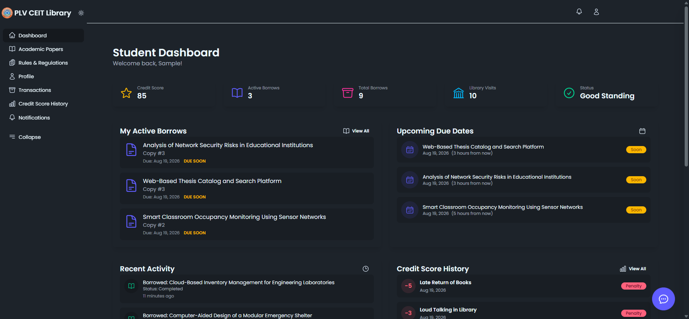
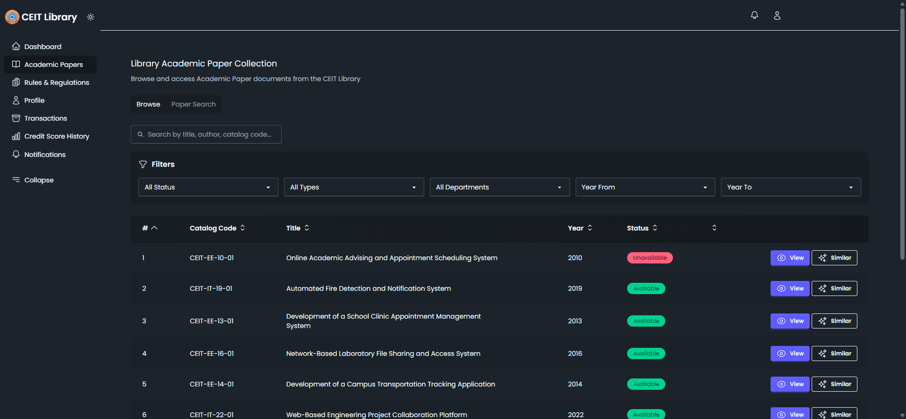
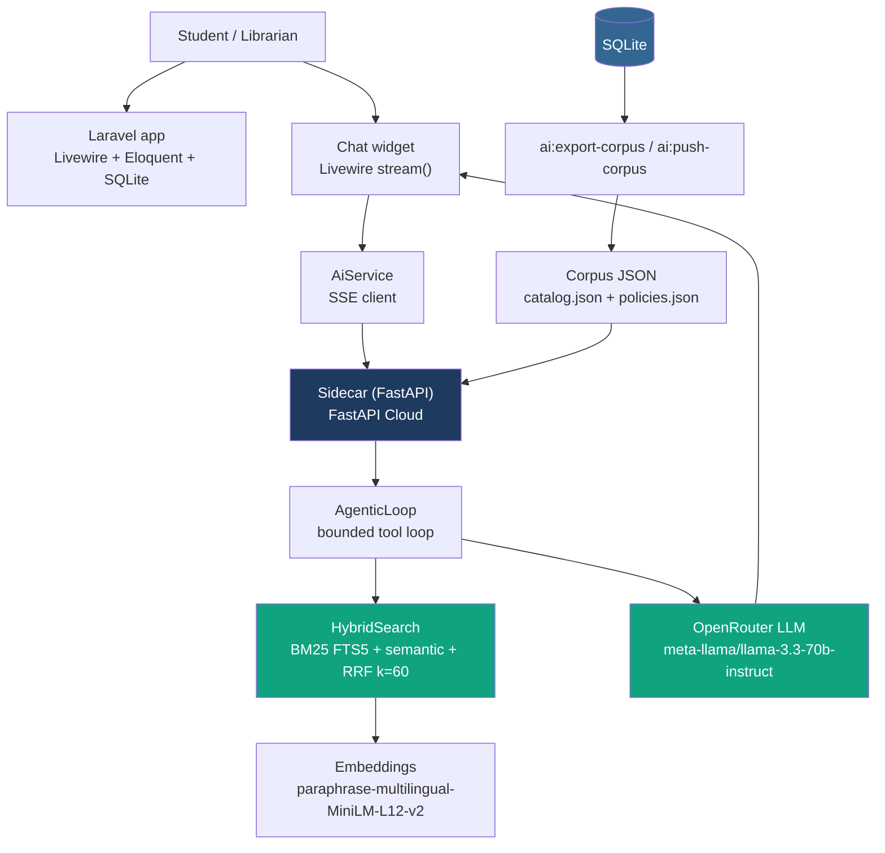

# CEIT Library — AI Library Assistant

<p align="center">
  
</p>

A library management system with an AI librarian for the College of
Engineering and Information Technology at Pamantasan ng Lungsod ng
Valenzuela (PLV). Students search the academic paper catalog, borrow
and return with QR codes, and ask the in-app assistant questions about
the catalog and the library rulebook — answered with citations,
grounded strictly in retrieved library content.

Search runs on a hybrid sidecar (FTS5 BM25 + multilingual semantic
embeddings, fused with Reciprocal Rank Fusion), deployed on FastAPI
Cloud, with the Laravel app as the front door.

## Demo

<p align="center">
  
</p>

<p align="center">
  
</p>

Live sidecar (health + search): `https://<your-sidecar>.fastapi.app`

The in-app chat widget is available on every authenticated page.

## Problem

Library catalog questions are buried in catalog codes, thesis PDFs, and
a printed rulebook. Students have to know what they're looking for
before they can find it — paraphrased questions, "books similar to X",
and policy questions ("what happens if I return late?") all need a human
at the circulation desk.

The CEIT Library assistant helps with:

1. Catalog search: natural-language queries over academic papers —
   paraphrase, exact title, or catalog code (`CEIT-IT-23-01`).
2. Paper filters: topic, author, year, department, and research
   adviser filters on the same search surface.
3. Policy Q&A: rulebook questions answered from the policy corpus with
   numbered citations.
4. Similar papers: "books like this" recommendations from the search
   index, with live copy availability.
5. Agentic search: multi-hop questions that one-shot retrieval can't
   answer, resolved through a bounded search loop.
6. Library operations: borrowing with QR codes, attendance, credit
   scores, and librarian batch scheduling.

Target users: CEIT students who want fast answers about papers and
library policy, and librarians who manage the catalog, rules, and
borrowing workflows.

## Quickstart

The full stack is two repos: the Laravel app and the Python search
sidecar.

### Prerequisites

- PHP 8.4 and [Composer](https://getcomposer.org/)
- Node.js and npm (Vite frontend build)
- Python 3.13 and [uv](https://docs.astral.sh/uv/)
- SQLite (default; no server database needed)

### 1. Laravel app

```bash
git clone https://github.com/PSergio984/CEIT-Library.git
cd CEIT-Library
composer install
cp .env.example .env        # fill SIDECAR_TOKEN (must match the sidecar)
php artisan key:generate
npm ci && npm run build     # required: views render @vite assets
php artisan migrate --seed
php artisan serve
```

### 2. Sidecar

```bash
git clone https://github.com/PSergio984/ceit-ai-sidecar.git
cd ceit-ai-sidecar
uv sync
cp .env.example .env        # SIDECAR_TOKEN must match the Laravel .env
uv run uvicorn app.main:app --port 8310
```

The sidecar binds loopback only when run locally. First start downloads
the ~470 MB embedding model.

### 3. Export the corpus and build the index

```bash
php artisan ai:export-corpus   # writes storage/app/ai-corpus/*.json
# trigger a rebuild on the sidecar:
curl -X POST -H "X-Sidecar-Token: $SIDECAR_TOKEN" http://127.0.0.1:8310/index/rebuild
```

### 4. Keep it fresh (optional)

Run the scheduler so exports, index sync, reminders, and overdue checks
run automatically:

```bash
php artisan schedule:work
```

The app runs at http://localhost:8000.

### Cloud deployment (sidecar on FastAPI Cloud)

The sidecar can run on FastAPI Cloud instead of loopback:

1. Set env vars in the FastAPI Cloud dashboard: `SIDECAR_TOKEN`,
   `LLM_API_KEY` (OpenRouter), `CORPUS_PATH=corpus`.
2. Point Laravel at it: `SIDECAR_URL=https://<your-sidecar>.fastapi.app`
   in `.env`.
3. Corpus freshness is handled automatically: `ai:push-corpus` (scheduled
   hourly) exports and uploads `catalog.json` + `policies.json` to the
   sidecar's `POST /corpus/upload`, which writes them and rebuilds the
   index atomically.

## Testing

Automated suites exist in both repos:

```bash
# Laravel (PHPUnit 13)
php artisan test                # 600+ tests: auth, borrowing, QR, Livewire, AI chat

# Sidecar (pytest)
uv run pytest                   # 78 tests: ranking, filters, API, agentic loop
uv run ruff check .
```

CI (GitHub Actions) runs lint, typecheck (PHPStan level 5 + baseline),
migrations, tests, SonarCloud, CodeQL, and a secrets scan on every push.

## Evaluation

### Retrieval evaluation

Golden-set evaluation in the sidecar (`app/eval.py`) against
[`data/golden_dataset.json`](https://github.com/PSergio984/ceit-ai-sidecar/blob/main/data/golden_dataset.json)
— 35 cases (catalog + policy, including negative "should return nothing"
cases). Current results (k=5):

- Precision@5: **0.60**
- Recall@5: **0.86**
- F1@5: **0.63**
- Top-1 rate: **83%**
- Negative pass rate: **100%** (all 5 out-of-domain queries correctly
  return nothing)

By category:

| Category | n | P@5 | Top-1 |
|----------|---|-----|-------|
| taglish (Taglish queries) | 6 | 0.80 | 0.50 |
| paraphrase | 14 | 0.70 | 1.00 |
| people (paper by author/adviser) | 4 | 0.50 | 1.00 |
| catalog_code (exact CEIT codes) | 2 | 0.30 | 0.50 |
| exact_title | 4 | 0.20 | 0.75 |

Run it yourself:

```bash
cd ceit-ai-sidecar
uv run python -m app.eval            # human-readable report
uv run python -m app.eval --json     # machine-readable report
```

### RAG flow evaluation

LLM-as-judge answer scoring (RELEVANT / PARTLY_RELEVANT /
NON_RELEVANT) is planned for Phase 13 of the roadmap — the golden
retrieval sets and negative cases already exist.

## Architecture


```mermaid
flowchart TD
    User["Student / Librarian"]
    App["Laravel app<br/>Livewire + Eloquent + SQLite"]
    Widget["Chat widget<br/>Livewire stream()"]
    AiService["AiService<br/>SSE client"]
    Sidecar["Sidecar (FastAPI)<br/>FastAPI Cloud"]
    Agent["AgenticLoop<br/>bounded tool loop"]
    Hybrid["HybridSearch<br/>BM25 FTS5 + semantic + RRF k=60"]
    Embedder["Embeddings<br/>paraphrase-multilingual-MiniLM-L12-v2"]
    LLM["OpenRouter LLM<br/>meta-llama/llama-3.3-70b-instruct"]
    Corpus["Corpus JSON<br/>catalog.json + policies.json"]
    Exporter["ai:export-corpus / ai:push-corpus"]
    DB[("SQLite")]

    User --> Widget
    User --> App
    Widget --> AiService
    AiService --> Sidecar
    Sidecar --> Agent
    Agent --> Hybrid
    Hybrid --> Embedder
    Agent --> LLM
    LLM --> Widget
    DB --> Exporter
    Exporter --> Corpus
    Corpus --> Sidecar

    style Sidecar fill:#1e3a5f,color:#fff
    style Hybrid fill:#10a37f,color:#fff
    style LLM fill:#10a37f,color:#fff
    style DB fill:#336791,color:#fff
```

The sidecar owns all search and LLM calls; the Laravel app never touches
the search index or the LLM key directly.

### Search internals

- **Keyword retrieval**: SQLite FTS5 (via `sqlitesearch`) — BM25
  ranking over the full corpus (no candidate pooling).
- **Semantic retrieval**: whole-document embeddings
  (`paraphrase-multilingual-MiniLM-L12-v2`), normalized, cosine
  similarity. No TF-IDF is used anywhere; no chunking (whole documents).
- **Fusion**: Reciprocal Rank Fusion with k=60 —
  `score = 1/(60 + rank)` per list. Metadata filters (paper type,
  department, year range, author, adviser) apply **before** fusion, so a
  filtered-out document can never outrank a relevant one.
- **Code pin**: exact `CEIT-XX-NN` catalog codes pin the matching paper
  to rank 1.
- **Atomic index**: versioned artifacts (`docs-N.json`,
  `vectors-N.npy`, `index-N.db`) swapped via `state.json`; readers never
  see a half-built index; old versions pruned (keep 2).

### Agentic search

`/chat/stream` runs a bounded function-calling loop (max 3 executed
searches). The first LLM call decides: no tool call → direct answer
(no search happened); tool calls are validated against a closed
pydantic schema (`extra="forbid"`) before touching the search seam, and
results merge into a deduplicated, numbered citation set. Answers are
streamed as SSE chunks (`data: {"c": "<delta>"}`) with `event: activity`
and `event: citations` frames; empty retrieval yields the canonical
refusal ("I don't have enough information") with zero LLM calls.

## Monitoring

- Sidecar: `GET /health` (index coverage + staleness) and `GET /metrics`
  (hand-rolled counters: searches, rebuilds, average latency, indexed
  documents).
- CI quality: SonarCloud gate, CodeQL, SonarQube secrets scan.
- Prometheus + Grafana dashboards (usage, latency, cost) are Phase 14 of
  the roadmap.

## Decisions and trade-offs

- **Hybrid BM25 + semantic over vector-only**: keyword search nails
  catalog codes and exact titles; semantic embeddings catch paraphrase
  and Taglish. RRF k=60 fusion needs no score normalization. Trade-off:
  two indexes to keep in sync (solved by the atomic versioned rebuild).
- **Sidecar as a separate service over an in-app library**: the search
  index and the LLM key live outside the Laravel app; the contract is a
  token-gated HTTP API with mirrored constants (`CITATION_KEYS`,
  `SSE_CHUNK_KEY`) so the shape cannot drift. Trade-off: AI features
  depend on a second service (deployed on FastAPI Cloud).
- **Whole-document embeddings (no chunking)**: simple and fast for a
  small corpus; prompts truncate documents at 600 characters. Trade-off:
  long papers lose detail — chunking is a revisit point as the corpus
  grows.
- **OpenRouter over a direct provider**: one SDK (openai), model
  swap via env (`LLM_MODEL`), no vendor lock-in. Trade-off: an extra
  dependency and an API key to manage (and rotate).
- **SQLite over PostgreSQL**: zero-ops for a campus-scale app; CI runs
  in-memory. Trade-off: multi-writer limits — PostgreSQL env vars are
  already scaffolded if it outgrows SQLite.
- **Corpus push for the cloud (not shared disk)**: `ai:push-corpus`
  uploads the export to `POST /corpus/upload`, which rebuilds atomically
  — no shared filesystem, corpus stays out of git (it contains author
  names).

## Project structure

```text
CEIT-Library/                 # Laravel app
  app/
    Console/Commands/         # ai:export-corpus, ai:push-corpus, ai:sync-index,
                              # ai:reconcile-index, overdue/reminder/batch commands
    Jobs/                     # AiIndexRebuildJob (+ immediate), SendPushNotificationJob
    Livewire/                 # components: admin/student pages, chat widget
    Logging/                  # PiiSanitizerProcessor (global PII redaction)
    Models/                   # 22 Eloquent models (User, AcademicPaper, RuleHeader, ...)
    Observers/                # index rebuild triggers on paper/rulebook changes
    Services/                 # AiService, AvailabilityService, SimilarPapersService,
                              # BorrowService, LibrarianStatusService, CorpusExporter, ...
  docs/
    adr/                      # 14 ADRs (chat streaming, citation rules, agentic loop, ...)
    codebase/                 # stack, architecture, conventions, concerns, ...
  routes/console.php          # scheduler (exports :05, push :07, sync :10, reconcile 02:00)
  tests/                      # PHPUnit: Unit + Feature (auth, borrowing, QR, AI)
ceit-ai-sidecar/              # FastAPI hybrid-search sidecar
  app/
    main.py                   # API: /search /chat/stream /index/rebuild /corpus/upload /health /metrics
    search.py                 # HybridSearch: BM25 + semantic + RRF k=60, filters, code pin
    ingest.py                 # corpus validation + embeddings
    rebuild.py                # atomic versioned rebuild
    rag.py                    # RAG prompts, SSE framing, citation keys
    agent.py                  # AgenticLoop: bounded tool loop
    eval.py                   # golden-set retrieval evaluation
  data/golden_dataset.json    # 35 evaluation cases
  tests/                      # pytest: ranking, filters, API, agentic loop
```

## Dataset

The corpus is exported from the database by `ai:export-corpus`:

- `catalog.json` — academic papers (title, authors, advisers, dean,
  department, publication year, paper type, catalog code).
- `policies.json` — the library rulebook (headers + regulations, e.g.
  ID requirements, penalties, borrowing rules).

The sidecar validates the export envelope (`schema_version: 1`) and
fails closed on malformed input. Exports contain author names — they are
gitignored and never committed.

## Limitations

- The LLM answer quality depends on OpenRouter availability; provider
  failures surface as a user-safe error event in the chat.
- LLM-as-judge answer evaluation and user feedback capture are Phase 13
  (retrieval evaluation exists today).
- No rate limits or cost guards on the LLM path yet (Phase 14).
- Whole-document embeddings cap prompt context at 600 characters per
  document.
- No Prometheus/Grafana dashboards yet (Phase 14) — only `/health` and
  `/metrics` counters.
- SQLite is single-writer; very high concurrency would require the
  scaffolded PostgreSQL move.
