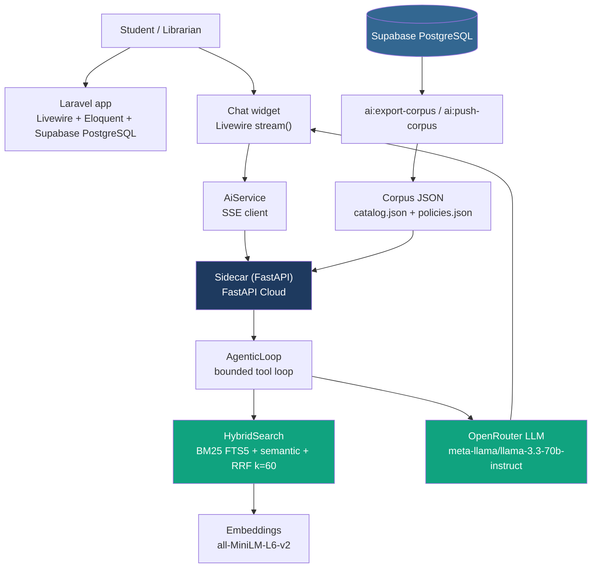

# CEIT Library — AI Library Assistant

<p align="center">
  
</p>

A library management system with an AI librarian for the College of
Engineering and Information Technology at Pamantasan ng Lungsod ng
Valenzuela (PLV). Students search the academic paper catalog, borrow
and return with QR codes, and ask the in-app assistant questions about
the catalog and the library rulebook — answered with citations,
grounded strictly in retrieved library content.

Search runs on a hybrid sidecar (FTS5 BM25 + English semantic
embeddings, fused with Reciprocal Rank Fusion), deployed on FastAPI
Cloud, with the Laravel app as the front door.

## Demo

<p align="center">
  
</p>

<p align="center">
  
</p>

Live sidecar (health + search): `https://ceit-ai-sidecar.fastapicloud.dev`

The in-app chat widget is available on every authenticated page.

### 5-minute demo path

1. Start the stack — `docker compose up --build` → open `http://localhost:8080`
   (or the bare-metal Quickstart below).
2. On the login page, click **Log in with demo student**.
3. Ask the assistant about the catalog (e.g. *"papers about machine learning"*) —
   activity lines stream while it searches, then a grounded answer arrives with
   numbered citations naming its sources.
4. Give the answer a thumbs up — feedback is forwarded to the sidecar's
   `/feedback` endpoint.
5. Open the papers search tab and filter by author or year — hybrid search with
   live availability badges over real circulation data.

Each completed answer also lands one structured usage record in
`storage/logs/ai-cost.log` (tokens + duration — see Capstone concepts).

## Problem

Library catalog questions are buried in catalog codes, thesis PDFs, and
a printed rulebook. Students have to know what they're looking for
before they can find it — paraphrased questions, "books similar to X",
and policy questions ("what happens if I return late?") all need a human
at the circulation desk.

The CEIT Library assistant helps with:

1. Catalog search: natural-language queries over academic papers —
   paraphrase, exact title, or catalog code (`CEIT-IT-23-01`).
2. Paper filters: topic, author, year, department, and research
   adviser filters on the same search surface.
3. Policy Q&A: rulebook questions answered from the policy corpus with
   numbered citations.
4. Similar papers: "books like this" recommendations from the search
   index, with live copy availability.
5. Agentic search: multi-hop questions that one-shot retrieval can't
   answer, resolved through a bounded search loop.
6. Library operations: borrowing with QR codes, attendance, credit
   scores, and librarian batch scheduling.

Target users: CEIT students who want fast answers about papers and
library policy, and librarians who manage the catalog, rules, and
borrowing workflows.

## Capstone concepts

Five of the seven program concepts from the capstone brief's first table — zero swaps:

| Concept | Where it lives |
|---------|----------------|
| API endpoints | `routes/web.php` `/api/*` (push subscription — payload validation + auth guard); token-gated sidecar HTTP contract in `app/Services/AiService.php` |
| Database | PostgreSQL (Supabase cloud or local compose `db` service), migrations + Eloquent models in `database/migrations` / `app/Models` |
| Authentication | Session auth with role gates: `app/Http/Middleware/AdminOnly.php`, `LibrarianOrAdmin.php`, `CheckCreditScore.php`; seeded demo-student login |
| Background jobs & cron | Schedules in `routes/console.php` (hourly corpus export/push/sync, overdue sweeps); `Docker/supervisord.conf` runs both `queue:work` and `schedule:work`; queued job in `app/Jobs/AiIndexRebuildJob.php` |
| LLM integration | Grounded streaming chat behind an endpoint: `AiService::chatStream()` + `app/Livewire/ChatWidget.php`; validated sidecar contract; per-answer cost log → `storage/logs/ai-cost.log` |

## Quickstart

The full stack is two repos: the Laravel app and the Python search
sidecar.

### Prerequisites

- PHP 8.4 and [Composer](https://getcomposer.org/)
- Node.js and npm (Vite frontend build)
- Python 3.13 and [uv](https://docs.astral.sh/uv/)
- Supabase PostgreSQL (the app database; SQLite is used by CI and the
  test suite)

### 1. Laravel app

```bash
git clone https://github.com/PSergio984/CEIT-Library.git
cd CEIT-Library
composer install
cp .env.example .env        # fill SIDECAR_TOKEN (must match the sidecar)
php artisan key:generate
npm ci && npm run build     # required: views render @vite assets
php artisan migrate --seed    # against Supabase PostgreSQL (see .env DB_* vars)
php artisan serve
php artisan schedule:work     # cron commands (hourly corpus sync, overdue sweeps)
php artisan queue:work --tries=3 --backoff=5   # database-queue jobs
```

### 2. Sidecar

```bash
git clone https://github.com/PSergio984/ceit-ai-sidecar.git
cd ceit-ai-sidecar
uv sync
cp .env.example .env        # SIDECAR_TOKEN must match the Laravel .env
uv run uvicorn app.main:app --port 8310
```

The sidecar binds loopback only when run locally. First start downloads
the compact English embedding model.

### 3. Export the corpus and build the index

```bash
php artisan ai:export-corpus   # writes storage/app/ai-corpus/*.json
# trigger a rebuild on the sidecar:
curl -X POST -H "X-Sidecar-Token: $SIDECAR_TOKEN" http://127.0.0.1:8310/index/rebuild
```

### 4. Keep it fresh (optional)

Run the scheduler so exports, index sync, reminders, and overdue checks
run automatically:

```bash
php artisan schedule:work
```

The app runs at http://localhost:8000.

### Or run it with Docker (front door + database)

```bash
# this repo: app (nginx+php-fpm) + local PostgreSQL 16, seeds the demo account
docker compose up --build
# open http://localhost:8080  (if taken: APP_PORT=8081 docker compose up -d)

# sidecar repo: search/chat service + Prometheus + Grafana
cd ../ceit-ai-sidecar
docker compose up --build
```

The containerized app reaches the sidecar through
`http://host.docker.internal:8310` by default (set `SIDECAR_BASE_URL` /
`SIDECAR_TOKEN` in this repo's `.env` to override). The login page's
**"Log in with demo student"** button signs in with the seeded
`student@plv.edu.ph` account.

### Cloud deployment (sidecar on FastAPI Cloud)

The sidecar can run on FastAPI Cloud instead of loopback:

1. Set env vars in the FastAPI Cloud dashboard: `SIDECAR_TOKEN`,
   `LLM_API_KEY` (OpenRouter), `CORPUS_PATH=corpus`.
2. Point Laravel at it: `SIDECAR_URL=https://ceit-ai-sidecar.fastapicloud.dev`
   in `.env`.
3. Corpus freshness is handled automatically: `ai:push-corpus` (scheduled
   hourly) exports and uploads `catalog.json` + `policies.json` to the
   sidecar's `POST /corpus/upload`, which writes them and rebuilds the
   index atomically.

## Testing

Automated suites exist in both repos:

```bash
# Laravel (PHPUnit 13)
php artisan test                # 604 tests: auth, borrowing, QR, Livewire, AI chat

# Sidecar (pytest)
uv run pytest                   # 144 tests, 1 skipped: ranking, filters, API, agentic loop
uv run ruff check .
```

CI (GitHub Actions) runs lint, typecheck (PHPStan level 5 + baseline),
migrations, tests, SonarCloud, CodeQL, and a secrets scan on every push.

## Evaluation

**The measured 10x:** what used to take minutes of manual catalog digging is now
a seconds-long question. On the 27-case golden set the production retriever puts
the correct document at rank 1 **86% of the time** (top-1 = 0.8636, hybrid +
blend re-rank) and refuses to invent hits on negative cases (**negative pass
rate = 1.0**) — so "find the right paper in seconds, with citations" is measured,
not claimed.

### Retrieval evaluation

Golden-set evaluation in the sidecar (`app/eval.py`) against
[`data/golden_dataset.json`](https://github.com/PSergio984/ceit-ai-sidecar/blob/main/data/golden_dataset.json)
— 27 cases regenerated from the bundled 1,338-doc corpus (catalog codes,
exact/paraphrase titles, authors, departments, years, plus 5 negative
"should return nothing" cases). Current results (k=5):

| Approach | P@5   | R@5   | F1@5  | Top-1 | Neg-pass |
|----------|-------|-------|-------|-------|----------|
| **hybrid** (production retrieval) | 0.4545 | 0.7239 | 0.3913 | **0.8182** | **1.0** |
| bm25     | 0.5455 | 0.7517 | 0.4321 | 0.7273 | 1.0 |
| semantic | 0.1091 | 0.3780 | 0.1414 | 0.2727 | 1.0 |
| hybrid + blend re-rank (shipped /search) | 0.4545 | 0.7239 | 0.3913 | **0.8636** | 1.0 |

**Winner rule (documented, stable):** for a library assistant the primary
quality gates are **top-1 rate** (the right document surfaces first — critical
for code/title lookups) and **negative-pass rate** (no irrelevant results);
F1@k breaks ties. Under that rule **hybrid wins**: the code pin nails top-1 on
all four catalog-code cases, and no negative ever leaks. Two fixes made the
shipped pipeline honest on the 1,338-doc corpus: the query tokenizer now keeps
digits (years and catalog codes reach FTS5), and `MIN_SEMANTIC_SIMILARITY`
was raised 0.25 → 0.5 so the semantic channel only fires where embeddings
discriminate.

By category (shipped pipeline: hybrid + blend re-rank):

| Category | n | P@5 | Top-1 |
|----------|---|-----|-------|
| catalog_code (exact CEIT codes) | 4 | 0.20 | 1.00 |
| exact_title | 8 | 0.20 | 0.75 |
| paraphrase | 6 | 0.67 | 0.83 |
| people (papers by author) | 4 | 0.90 | 1.00 |

Run it yourself:

```bash
cd ceit-ai-sidecar
uv run python -m app.eval            # human-readable report
uv run python -m app.eval --json     # machine-readable report
uv run python -m app.eval --with-rerank   # also score the shipped pipeline
```

### RAG flow evaluation

LLM-as-judge answer scoring (`app/judge.py`, same `RagService` path the app
uses) on 40 questions regenerated for the bundled corpus. Current recorded run
(10-question sample, `meta-llama/llama-3.3-70b-instruct`, top_k=5):

- **RELEVANT** 9 · **PARTLY_RELEVANT** 1 · **NON_RELEVANT** 0
- Relevant rate: **0.90** · Partly-or-better rate: **1.00**

```bash
cd ceit-ai-sidecar
uv run python -m app.judge                     # all 40 questions
uv run python -m app.judge --sample 10 --seed 42   # a 10-question sample
```

## Architecture


```mermaid
flowchart TD
    User["Student / Librarian"]
    App["Laravel app<br/>Livewire + Eloquent + Supabase PostgreSQL"]
    Widget["Chat widget<br/>Livewire stream()"]
    AiService["AiService<br/>SSE client"]
    Sidecar["Sidecar (FastAPI)<br/>FastAPI Cloud"]
    Agent["AgenticLoop<br/>bounded tool loop"]
    Hybrid["HybridSearch<br/>BM25 FTS5 + semantic + RRF k=60"]
    Embedder["Embeddings<br/>all-MiniLM-L6-v2"]
    LLM["OpenRouter LLM<br/>meta-llama/llama-3.3-70b-instruct"]
    Corpus["Corpus JSON<br/>catalog.json + policies.json"]
    Exporter["ai:export-corpus / ai:push-corpus"]
    DB[("Supabase PostgreSQL")]

    User --> Widget
    User --> App
    Widget --> AiService
    AiService --> Sidecar
    Sidecar --> Agent
    Agent --> Hybrid
    Hybrid --> Embedder
    Agent --> LLM
    LLM --> Widget
    DB --> Exporter
    Exporter --> Corpus
    Corpus --> Sidecar

    style Sidecar fill:#1e3a5f,color:#fff
    style Hybrid fill:#10a37f,color:#fff
    style LLM fill:#10a37f,color:#fff
    style DB fill:#336791,color:#fff
```

The sidecar owns all search and LLM calls; the Laravel app never touches
the search index or the LLM key directly.

### Search internals

- **Keyword retrieval**: SQLite FTS5 (via `sqlitesearch`) — BM25
  ranking over the full corpus (no candidate pooling).
- **Semantic retrieval**: whole-document embeddings
  (`all-MiniLM-L6-v2`), normalized, cosine
  similarity. No TF-IDF is used anywhere; no chunking (whole documents).
- **Fusion**: Reciprocal Rank Fusion with k=60 —
  `score = 1/(60 + rank)` per list. Metadata filters (paper type,
  department, year range, author, adviser) apply **before** fusion, so a
  filtered-out document can never outrank a relevant one.
- **Code pin**: exact `CEIT-XX-NN` catalog codes pin the matching paper
  to rank 1.
- **Atomic index**: versioned artifacts (`docs-N.json`,
  `vectors-N.npy`, `index-N.db`) swapped via `state.json`; readers never
  see a half-built index; old versions pruned (keep 2).

### Agentic search

`/chat/stream` runs a bounded function-calling loop (max 3 executed
searches). The first LLM call decides: no tool call → direct answer
(no search happened); tool calls are validated against a closed
pydantic schema (`extra="forbid"`) before touching the search seam, and
results merge into a deduplicated, numbered citation set. Answers are
streamed as SSE chunks (`data: {"c": "<delta>"}`) with `event: activity`
and `event: citations` frames; empty retrieval yields the canonical
refusal ("I don't have enough information") with zero LLM calls.

## Monitoring

- Sidecar: `GET /health` (index coverage + staleness) and `GET /metrics`
  (Prometheus counters: searches, chat retrievals, rebuilds, latency,
  feedback up/down, indexed documents).
- `POST /feedback` — the chat widget's thumbs up/down forwards the query,
  answer, and retrieved doc ids; the sidecar appends a JSONL line and feeds
  the feedback counters.
- **LLM cost log** — `storage/logs/ai-cost.log` (`ai_cost` daily channel, 30 days) records per-answer `prompt_tokens`/`completion_tokens`/`duration_ms` via `AiService::logChatCost()`; `tokens_estimated: true` when sidecar omits the `usage` event (heuristic `mb_strlen/4`, see `config/logging.php:79` + `config/services.php:42`).
- **Prometheus + Grafana** — the sidecar's `docker compose up --build`
  provisions both and a "CEIT AI Sidecar" dashboard (6 charts: retrieval
  traffic, latency p95/average, feedback, indexed docs, rebuilds).
- CI quality: SonarCloud gate, CodeQL, SonarQube secrets scan.

## Decisions and trade-offs

- **Hybrid BM25 + semantic over vector-only**: keyword search nails
  catalog codes and exact titles; semantic embeddings catch paraphrase.
  RRF k=60 fusion needs no score normalization. Trade-off:
  two indexes to keep in sync (solved by the atomic versioned rebuild).
- **Sidecar as a separate service over an in-app library**: the search
  index and the LLM key live outside the Laravel app; the contract is a
  token-gated HTTP API with mirrored constants (`CITATION_KEYS`,
  `SSE_CHUNK_KEY`) so the shape cannot drift. Trade-off: AI features
  depend on a second service (deployed on FastAPI Cloud).
- **Whole-document embeddings (no chunking)**: simple and fast for a
  small corpus; prompts truncate documents at 600 characters. Trade-off:
  long papers lose detail — chunking is a revisit point as the corpus
  grows.
- **OpenRouter over a direct provider**: one SDK (openai), model
  swap via env (`LLM_MODEL`), no vendor lock-in. Trade-off: an extra
  dependency and an API key to manage (and rotate).
- **Supabase PostgreSQL over SQLite**: a shared cloud database for the
  real app; SQLite remains the in-memory CI/test database. Trade-off: a
  network database dependency and pooler-compatible PDO settings
  (emulated prepares are enabled for the transaction pooler).
- **Corpus push for the cloud (not shared disk)**: `ai:push-corpus`
  uploads the export to `POST /corpus/upload`, which rebuilds atomically
  — no shared filesystem, corpus stays out of git (it contains author
  names).

## Project structure

```text
CEIT-Library/                 # Laravel app
  app/
    Console/Commands/         # ai:export-corpus, ai:push-corpus, ai:sync-index,
                              # ai:reconcile-index, overdue/reminder/batch commands
    Jobs/                     # AiIndexRebuildJob (+ immediate), SendPushNotificationJob
    Livewire/                 # components: admin/student pages, chat widget
    Logging/                  # PiiSanitizerProcessor (global PII redaction)
    Models/                   # 22 Eloquent models (User, AcademicPaper, RuleHeader, ...)
    Observers/                # index rebuild triggers on paper/rulebook changes
    Services/                 # AiService, AvailabilityService, SimilarPapersService,
                              # BorrowService, LibrarianStatusService, CorpusExporter, ...
  docs/
    adr/                      # 14 ADRs (chat streaming, citation rules, agentic loop, ...)
    codebase/                 # stack, architecture, conventions, concerns, ...
  routes/console.php          # scheduler (exports :05, push :07, sync :10, reconcile 02:00)
  tests/                      # PHPUnit: Unit + Feature (auth, borrowing, QR, AI)
ceit-ai-sidecar/              # FastAPI hybrid-search sidecar
  app/
    main.py                   # API: /search /chat/stream /index/rebuild /corpus/upload /health /metrics
    search.py                 # HybridSearch: BM25 + semantic + RRF k=60, filters, code pin
    ingest.py                 # corpus validation + embeddings
    rebuild.py                # atomic versioned rebuild
    rag.py                    # RAG prompts, SSE framing, citation keys
    agent.py                  # AgenticLoop: bounded tool loop
    eval.py                   # golden-set retrieval evaluation
  data/golden_dataset.json    # 27 evaluation cases
  tests/                      # pytest: ranking, filters, API, agentic loop
```

## Dataset

The corpus is exported from the database by `ai:export-corpus`:

- `catalog.json` — academic papers (title, authors, advisers, dean,
  department, publication year, paper type, catalog code).
- `policies.json` — the library rulebook (headers + regulations, e.g.
  ID requirements, penalties, borrowing rules).

The sidecar validates the export envelope (`schema_version: 1`) and
fails closed on malformed input. Exports contain author names — they are
gitignored and never committed.

## Limitations

- The LLM answer quality depends on OpenRouter availability; provider
  failures surface as a user-safe error event in the chat.
- Feedback capture is manual (thumbs up/down in the chat) — there is no
  end-to-end answer-quality loop beyond the recorded judge runs yet.
- No rate limits or cost guards on the LLM path yet (Phase 14).
- Whole-document embeddings cap prompt context at 600 characters per
  document.
- The bundled policy corpus is a synthetic placeholder (Faker-Latin
  regulation text), so policy Q&A is exercised end-to-end in the app but
  is not part of the judged evaluation (catalog-only question set).
- The app database is Supabase PostgreSQL; SQLite is used only for CI and
  the test suite.
